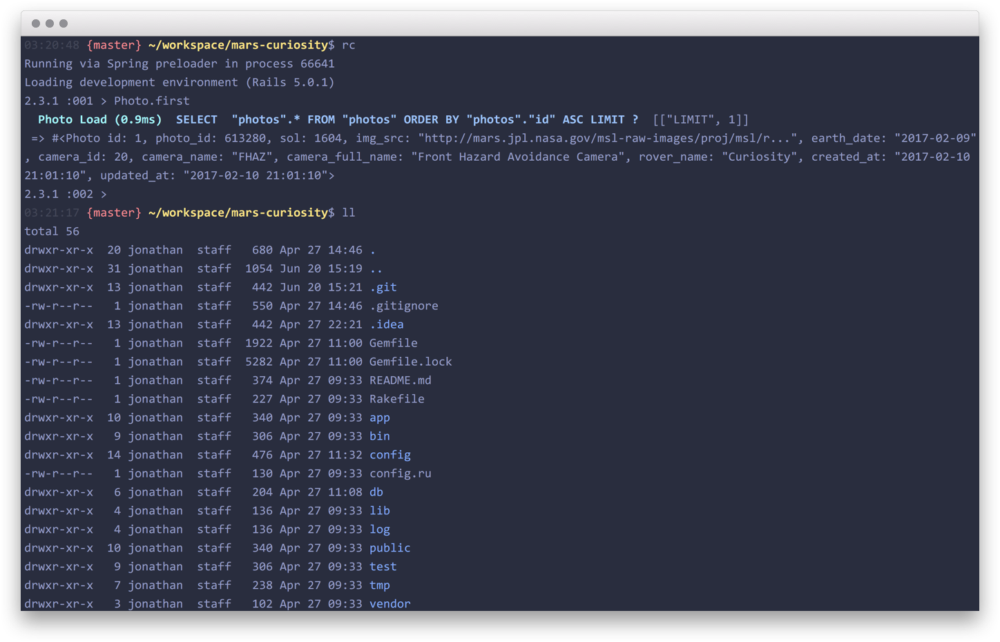

# iTerm2 Material Design - Palenight Theme

This is an iTerm2 color scheme based on the Palenight theme by [Mattia Astorino](http://equinsuocha.io/material-theme/#/default).

## How to use it

1. Clone the repo or download the file `palenight.itermcolors`
2. *iTerm2 > Preferences > Profiles > Colors Tab*
3. Click *Load Presets...*
4. Click *Import...*
5. Select the `palenight.itermcolors` file
5. Select the *palenight* from *Load Presets...*

## Good fonts for Palenight
- [Consolas](https://www.fonts.com/font/microsoft-corporation/consolas/regular)
- [Roboto Mono](http://www.1001freefonts.com/roboto_mono.font)
- [Fira Code](https://github.com/tonsky/FiraCode)

## Color Scheme Palettes

Color             | Default          |  Lighter   |
---               | ---              |  ---       |
Black             | `#292d3e`        |  `#434758` |
Red               | `#f07178`        |  `#ff8b92` |
Green             | `#c3e88d`        |  `#ddffa7` |
Yellow            | `#ffcb6b`        |  `#ffe585` |
Blue              | `#82aaff`        |  `#9cc4ff` |
Magenta           | `#c792ea`        |  `#e1acff` |
Cyan              | `#89ddff`        |  `#a3f7ff` |
White             | `#d0d0d0`        |  `#ffffff` |